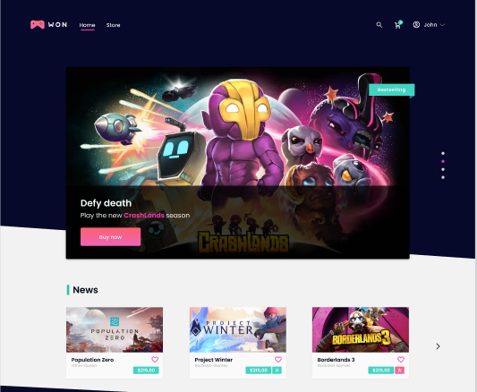

# WonGames 🎮
This repository refers to a awesome game store made with React 🚀 <br />

<p align="center" t>
  
</p>


# Proposal 🔥

<p align="center" t>
  
</p>

This project was made to approach and practice advanced concepts of React, such as development directed to components, global state management, GraphQL, server-side redering, static site generation, content management via CMS with Strapi and development of components with TDD.

For this purpose, this project uses Next.js as the main framework and has as concept a fictional game store.

# Tecnologies 🚀
Next.js ⚛️ <br />
React ⚛️ <br />
GraphQL ⚛️ <br />
Apollo ⚛️ <br />
Styled-Components 💅 <br />
Axios ⚛️ <br />
Styled Icons 💅 <br />
Typescript 🦕 <br />
Storybook 📕 <br />
Jest 🧪 <br />
Cypress 🧪 <br />
React Testing Library 🐙 <br />

# Storybook 📕
To see all the components developed in this application in isolation, you can run <code> yarn storybook</code> to open the Storybook at <br /> <code>https://localhost:6006/</code>

# Tests 🧪
To run all tests, you can run <code>yarn test</code> and pass <code>--watch</code> or/and <code>-u</code> to run in watch mode and generate snapshots, respectively.

# How to get this repository? 🤔
To obtain this project, follow the steps:
1. Clone this repository using <code> git clone </code>.
2. Run the <code> yarn </code> command at the root of the cloned project folder to download the dependencies.
3. Run <code> yarn dev </code> at the root of the project folder to start the application in development mode.
4. Open the application in your emulator. 🚀 <br />

Obs.: You can use <code> npm </code> too.

# How to contribute? 😍
**Fork this repository**
```bash
# Clone your fork
$ git clone your-fork-url && cd wongames

# Create a branch with your feature or bug fix
$ git checkout -b my-branch

# Commit your changes
$ git commit -m 'my changes'

# Push your branch
$ git push origin my-branch
```

Delete your branch, if you want, when your pull request merge. <br />

Made with 💜 by <a href="https://www.linkedin.com/in/andrecampll/" target="_blank"> andrecampll </a>. <br />
<br />
